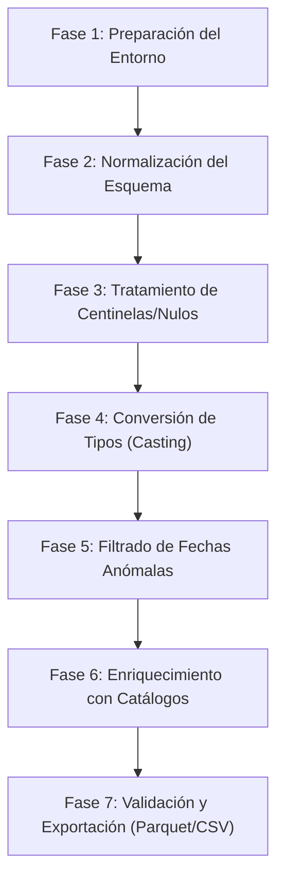

# Plan de Acción para la Limpieza y Preparación de Datos - EHRIJ 2022

**Objetivo:** Transformar el conjunto de datos crudo `delit_jc_ehriij2022.csv` en un producto de datos analítico, estructurado, limpio y enriquecido con sus catálogos correspondientes.

---

## 📋 Diagrama de Flujo del Pipeline de Limpieza

---

## 🛠️ Fase 1: Saneamiento y Preparación del Directorio

1. **Eliminar archivo residual:**
   - Eliminar el archivo inservible `metadatos\` (0 bytes) generado por artefactos de descompresión.
2. **Crear estructura de carpetas de salida:**
   - Crear el directorio `datos_procesados/` para almacenar los archivos limpios sin modificar los originales.
3. **Control de Calidad Inicial (Inmutabilidad):**
   - Garantizar que los archivos originales en `conjunto_de_datos/` y `catalogos/` permanezcan de solo lectura.

---

## 🔤 Fase 2: Normalización del Esquema y Nombres de Variables

1. **Estandarización a `snake_case`:**
   - Asegurar que todas las columnas mantengan nombres limpios en minúsculas y sin caracteres especiales.
2. **Verificación de Clave Primaria:**
   - Definir formalmente la clave compuesta `(ubicgeoc, cod_expe, cod_deli)` para auditar que no se introduzcan registros duplicados durante las transformaciones.
3. **Formato de Ceros a la Izquierda (*Zero Padding*):**
   - Asegurar que `ubicgeoc` y `muocurri` se mantengan formateados a 5 dígitos con ceros iniciales (ej. `'01001'`).

---

## 🧹 Fase 3: Tratamiento de Valores Centinela y Nulos

1. **Diccionario de Mapeo de Centinelas:**
   - Mapear explícitamente los valores que representan ausencia de datos a `NaN`/`None`:
     - Variables categóricas (`califide`, `consumac`, `forcomis`, `foraccio`, `modadel`, `clasitip`): Mapear `'9'` -> `NaN`.
     - Ubicación geográfica (`entiocur`, `muocurri`): Mapear `'9'`, `'99'`, `'99999'` -> `NaN`.
     - Variables de conteo (`totalca1`, `totalca2`): Mapear `'NSS'` (No Se Sabe) y `'9'` -> `NaN`.
     - Campo de fecha (`fec_ocur`): Mapear `'NO IDENTIFICADA'` -> `NaT`.
2. **Generación de Columnas de Control / Banderas:**
   - Crear columnas booleanas auxiliares (ejemplo: `fec_ocur_es_identificada`) para permitir filtrados rápidos en análisis exploratorios sin perder información del sesgo de no respuesta.

---

## ⏳ Fase 4: Transformación de Tipos de Datos (*Type Casting*)

1. **Parseo de Fechas:**
   - Convertir `fec_ocur` al formato fecha ISO-8601 (`YYYY-MM-DD`).
   - Extraer atributos derivados: `fec_ocur_anio`, `fec_ocur_mes`, `fec_ocur_dia`.
2. **Casteo de Métricas Cuantitativas:**
   - Convertir `totalca1` (imputados) y `totalca2` (víctimas) a tipos de datos enteros anulables (`Int64`).
3. **Optimizaciones Categóricas:**
   - Convertir las columnas de códigos de catálogo a tipos `category` para reducir el consumo de memoria en RAM de ~27 MB a < 5 MB.

---

## 🚨 Fase 5: Tratamiento de Fechas Anómalas y Errores de Sistema

1. **Identificación y Corrección de Outliers Históricos:**
   - Tratar las fechas anómalas detectadas (`31/12/1969` por timestamp de Unix nulo y `15/09/1899` / `25/09/1899` por épocas de hojas de cálculo) reasignándolas a `NaT` (Not a Time).
2. **Validación de Rango Lógico de Fechas:**
   - Establecer un filtro de coherencia para fechas de ocurrencia válidas entre `1970-01-01` y `2021-12-31`.

---

## 🔗 Fase 6: Enriquecimiento de Datos y Join con Catálogos

1. **Integración con Tablas Maestras (`catalogos/*.csv`):**
   - Realizar cruces (*left joins*) para añadir descripciones textuales legibles junto a los códigos numéricos:
     - `delirie8` -> Descripción amplia del delito (`descrip_delito`).
     - `califide` -> Calificación del delito (`descrip_califide`).
     - `consumac` -> Grado de consumación (`descrip_consumac`).
     - `forcomis` -> Forma de comisión (`descrip_forcomis`).
     - `foraccio` -> Forma de acción (`descrip_foraccio`).
     - `modadel` -> Modalidad del delito (`descrip_modadel`).
     - `ele_comi` -> Elementos de comisión (`descrip_elecomi`).
     - `ticoncur` -> Tipo de concurso (`descrip_ticoncur`).
     - `clasitip` -> Clasificación típica (`descrip_clasitip`).
     - `entiocur` / `muocurri` -> Nombre del Estado y Municipio de ocurrencia (`nombre_entidad`, `nombre_municipio`).

---

## 📊 Fase 7: Validación, Pruebas de Calidad y Exportación

1. **Pruebas de Integridad de Datos:**
   - Confirmar que el conteo final de registros permanezca en **404,264 filas**.
   - Verificar que no existan valores nulos no intencionados en las claves primarias.
2. **Generación de Entregables Operativos:**
   - **`datos_procesados/delit_jc_ehriij2022_limpio.csv`:** Dataset limpio estandarizado en formato CSV.
   - **`datos_procesados/delit_jc_ehriij2022_limpio.parquet`:** Dataset optimizado en formato Parquet (mayor velocidad de lectura e integración con herramientas como DuckDB, PowerBI, Python o R).
   - **`datos_procesados/delit_jc_ehriij2022_enriquecido.parquet`:** Dataset consolidado con descripciones completas de los 12 catálogos listo para análisis.

---

## 🚀 Próximo Paso Sugerido
¿Deseas que procedamos a ejecutar el script de limpieza automatizado en Python siguiendo este Plan de Acción?
