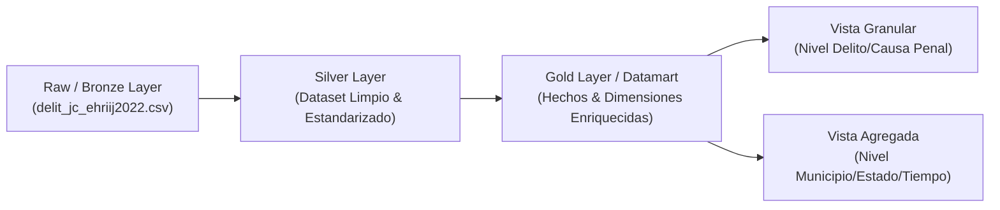
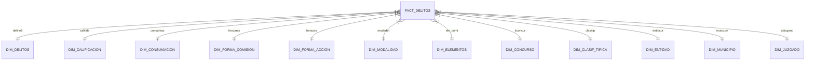

# Propuesta Estratégica: Integración, Modelado Multidimensional y Datamart Analítico - EHRIJ 2022

**Documento:** `PROPUESTA_INTEGRACION_Y_DATAMART.md`  
**Fase:** Ingeniería de Datos Proyectiva (Paso Siguiente)  
**Enfoque:** Preparación de una arquitectura de datos flexible y desacoplada, orientada a soportar cualquier objetivo analítico futuro (modelado descriptivo, tableros BI, minería de datos o econometría).

---

## 📌 1. Visión General de la Arquitectura de Datos

Para anticipar las necesidades analíticas sin restringir el uso final del dataset, se propone transformar la información cruda en una **Arquitectura en Capas (Medallion Architecture / Data Lakehouse Pattern)**:

---

## 🔗 2. Integración de Datasets y Relación con Catálogos

El modelo relacional original consta de **1 Tabla de Hechos** y **12 Tablas de Catálogo (Dimensiones)**. La integración se realizará aplicando un modelo en estrella (*Star Schema*):

### Reglas de Integración Relacional:
1. **Integridad Referencial Garantizada:** Cruce tipo *Left Outer Join* manteniendo el 100% de los registros de la tabla de hechos (404,264 filas).
2. **Preservación de Códigos Originales:** Cada atributo descriptivo preservará tanto la clave numérica original (`entiocur = '01'`) como su valor interpretado (`nombre_entidad = 'Aguascalientes'`).
3. **Normalización de Claves Geográficas:** Creación de la clave compuesta `cve_geo_municipio` (5 dígitos: `01001`) para permitir enlaces directos con capas cartográficas de INEGI (GeoJSON / Shapefiles) y datos del CONEVAL/CONAPO.

---

## 🏷️ 3. Homologación y Agrupación de Categorías

Dado que el catálogo del INEGI (`delirie8.csv`) contiene 151 tipologías penales detalladas, se propone crear **Categorías Homologadas Macro** para simplificar visualizaciones y análisis comparativos:

### A. Clasificación Penal Macro (`macro_categoria_delito`)
- **Delitos contra la Vida y la Integridad Personal:** Homicidio, feminicidio, lesiones, aborto.
- **Delitos contra el Patrimonio:** Robo, despojo, fraude, abuso de confianza, daño a la propiedad.
- **Delitos contra la Libertad y Seguridad Sexual:** Violación, acoso sexual, abuso sexual, estupro.
- **Delitos contra la Familia:** Violencia familiar, incumplimiento de obligaciones de asistencia familiar.
- **Delitos contra la Salud y Delincuencia Organizada:** Narcomenudeo, posesión de armas, portación prohibida.
- **Delitos cometidos por Servidores Públicos y Corrupción:** Abuso de autoridad, cohecho, peculado.
- **Otros Delitos del Fuero Común:** Amenazas, falsificación, etc.

### B. Homologación de Gravedad e Intencionalidad
- **`gravedad_intencionalidad`:**
  - `Doloso / Intencional` (`califide == 1`)
  - `Culposo / No Intencional` (`califide == 2`)
  - `No Especificado` (si `califide` es nulo).
- **`grado_ejecucion`:**
  - `Consumado` (`consumac == 1`)
  - `Tentativa` (`consumac == 2`)
  - `No Especificado`.

---

## 💡 4. Creación de Variables Derivadas (Feature Engineering)

Para permitir respuestas inmediatas a preguntas de negocio o investigación que aún no han sido formuladas, se propone incorporar las siguientes **variables derivadas**:

### A. Dimensión Geográfico-Jurisdiccional
* **`flag_movilidad_delictiva` (Booleana):**
  * `True`: Si la entidad de ocurrencia del delito (`entiocur`) difiere de la entidad donde se ubica el juzgado (`ubicgeoc[:2]`).
  * *Utilidad:* Medir desplazamiento o persecución inter-estatal de delitos.
* **`region_geografica_inegi`:**
  * Categorización en regiones oficiales: *Norte, Noroeste, Noreste, Centro-Norte, Centro, Occidente, Sur-Sureste*.

### B. Dimensión Temporal y Reagrupación Analítica
* **`fec_ocur_trimestre` / `fec_ocur_semestre`:** Agrupadores temporales estandarizados.
* **`dia_semana_ocurrencia`:** Extracción del día de la semana (Lunes a Domingo) para análisis de patrones temporales.
* **`antiguedad_procesamiento_anios`:**
  * Diferencia en años entre el año de ocurrencia del delito y el año del censo (`2021`).
  * *Utilidad:* Identificar el rezago judicial o la demora entre la comisión del hecho y su judicialización en juzgados de control.

### C. Dimensión de Impacto e Involucrados
* **`ratio_imputados_por_victima`:** `totalca1 / totalca2` (Medida de multiplicidad o delincuencia en grupo vs. individual).
* **`flag_victima_multiple` (Booleana):** `True` si `totalca2 > 1`.
* **`flag_imputado_multiple` (Booleana):** `True` si `totalca1 > 1`.
* **`clasificacion_impacto_victimas`:** Categorización categórica: *Sin víctimas directas, Víctima individual, Víctima múltiple (2-5), Víctima masiva (>5)*.

---

## 🗄️ 5. Estructura del Datamart Final Preparado

El resultado de esta fase será una suite de **3 Datamarts Analíticos** listos para consumir en Python, R, SQL, PowerBI, Tableau o DuckDB:

| Datamart / Capa | Formato Recomendado | Descripción / Nivel de Granularidad |
| :--- | :--- | :--- |
| **`datamart_delitos_granular`** | `Parquet` / `CSV` | **Nivel Registro de Delito (404,264 filas × 38 columnas)**. Contiene la totalidad de los datos limpios, variables derivadas y descripciones de catálogos. |
| **`datamart_agregado_municipal`** | `Parquet` / `CSV` | **Nivel Municipio-Año-Tipo de Delito**. Agregaciones de totales de delitos, víctimas e imputados por municipio para análisis espacial. |
| **`datamart_agregado_temporal`** | `Parquet` / `CSV` | **Nivel Estado-Mes-Serie de Tiempo**. Agregaciones mensuales por entidad federativa ideales para análisis de tendencias temporales. |

---

## 🎯 Resumen de Beneficios de este Paso Previas

1. **Flexibilidad Total:** No importa qué objetivo o pregunta analítica definas más adelante (ej. *"¿Cuáles son los municipios con mayor violencia de género?"* o *"¿Existe rezago en delitos patrimoniales?"*), el dataset ya contará con las variables calculadas.
2. **Máxima Eficiencia de Memoria:** Al exportar en formato **Parquet**, el tamaño del archivo se reducirá de ~27 MB a **~4 MB**, acelerando las consultas en más de un 10x.
3. **Cero Retrabajo:** Se evita tener que re-procesar los catálogos o re-calcular columnas derivadas cada vez que se realice un nuevo análisis.

---

## 🚀 ¿Cómo deseas proceder?
¿Te parece adecuada esta estructura prospectiva? Podemos dejar este plan listo para que, una vez que definas tus objetivos de análisis, ejecutemos de forma integrada tanto la limpieza como la generación del Datamart Final.
